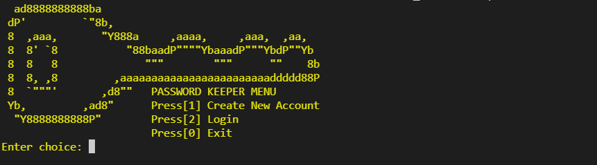
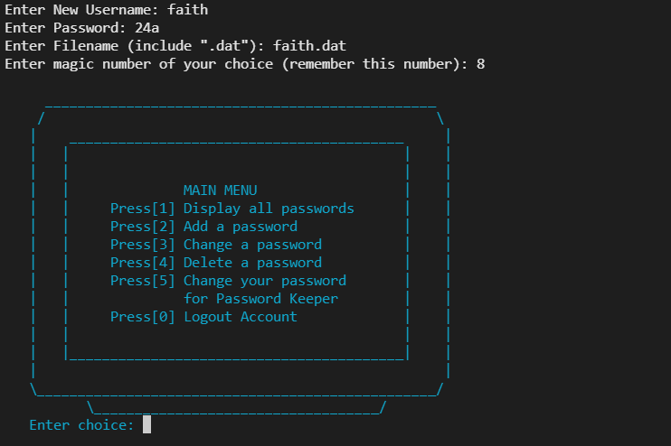

<h1 align="center">
Final Machine Project in CCPROG2

(Programming with Structured Data Types)
</h1>

📝**About**:
   - An application to store users’ passwords in a password protected encrypted file. 
   - This implementation used .dat files to store users' passwords.
   - Programming Language used: C.

💻**To run**:

   - Install C-program compiler, compile, then run.
