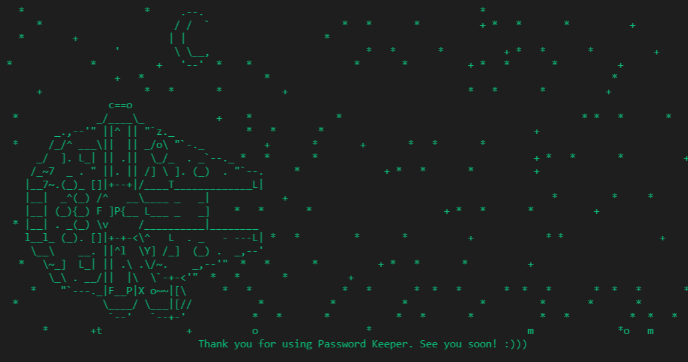

<h1 align="center">
Final Machine Project in CCPROG2

(Programming with Structured Data Types)
</h1>

📝**About**: 
   - This implementation uses .dat files to store users' passwords.
   - Programming Language used: C.

💻**To run**:

   - Install C-program compiler, compile, then run.
